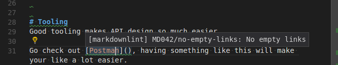

Even before we moved our site to a [JAM stack](https://jamstack.org/) we edited a number of markdown files, for example README files on our GitHub repositories.
So getting any extra efficiency for something we do a lot of was a noticeable win.
Because markdown is not WYSIWYG unless you have an editor with a preview a noticeable hassle when you edit markdown files is that sometimes there's errors that only show up when you build the pages.
Having a long feedback definitely impacts your productivity, most notably because it risks interrupting the flow of your writing if you have to build the pages to validate that they work.

## Use an editor that can properly support markdown

Because markdown is not WYSIWYG an editor that will do proper [syntax highlighting](https://en.wikipedia.org/wiki/Syntax_highlighting) is very uesful for editing markdown files. As such we often edit markdown with Vim or VS code.

Just like editing other code, this provides a substantially better user experience for editing as you can more readily see the structure of what you are doing.

And *exactly* like editing code, you have the ability to have syntax highlighting for the code in your markdown code blocks that is highlighted in the language the code block is in. This makes writing articles containing code snippets much easier.

## Linting via VS code plugin

Seeing as we use VS code already we can install a [markdown linter extension](https://github.com/DavidAnson/vscode-markdownlint) that gives immediate linting for our markdown files.

So for example have a look at this screenshot from when I was writing a draft for a post on here:

Because of the integration with the IDE I'm getting immediate feedback in my editor that something is wrong, I don't have to generate the pages to get an error and every time I can catch something fast is a small productivity gain.